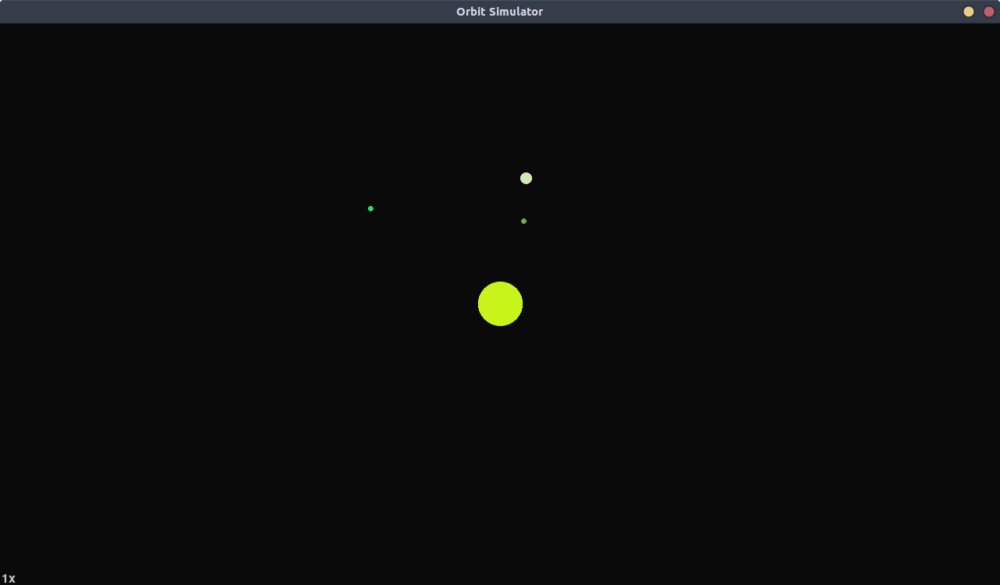

# Orbit Simulator
A simple orbit simulator based on Newton's law of universal gravitation.

# Requirements
- `python 3`
- `pygame~=2.0.0`

# Controls
- `Q` to quit
- `,` to slow down time
- `.` to speed up time
- `(space)` to pause

# Screenshot

